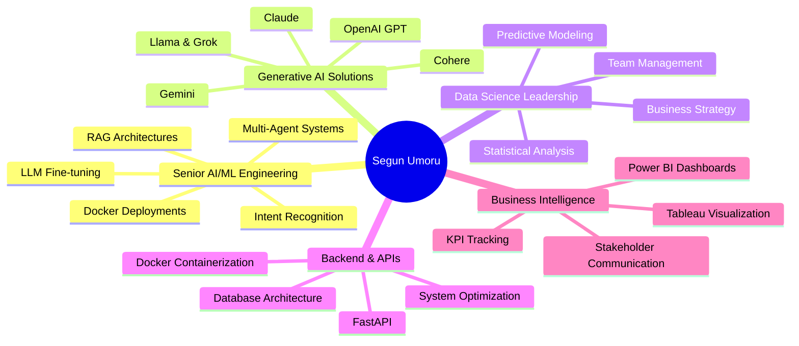

<div align="center">
  
</div>

<div align="center">
  
  ### 🚀 Building AI Systems That Solve Real Problems
  
  <a href="https://www.linkedin.com/in/segun-umoru/"></a>
  <a href="https://twitter.com/SegunUmoru"></a>
  <a href="https://github.com/segunumoru1"></a>
  <a href="mailto:segunumoru1@gmail.com"></a>
  
  <br/>
  
  
  
  

</div>

<br/>


## 👨🏽‍💻 About Me

```python
class SeniorAIEngineer:
    def __init__(self):
        self.name = "Segun Umoru"
        self.role = "Senior AI/ML Engineer & Data Scientist"
        self.experience = "5+ years"
        self.location = "Lagos, Nigeria"
        self.education = ["Mathematics", "Data Science"]
        
    def current_focus(self):
        return [
            "Building AI agents with LangChain/LangGraph, CrewAI, AutoGen",
            "Developing RAG systems with Pinecone + PostgreSQL, ChromaDB, FAISS",
            "Fine-tuning LLMs (OpenAI, Claude, Gemini, Cohere, Llama, Grok)",
            "Creating scalable backend APIs with Docker + FastAPI",
            "Leading data-driven transformations across industries"
        ]
    
    def impact(self):
        return {
            "profitability_increase": "40%",
            "project_delivery_speed": "40% faster",
            "user_engagement_growth": "35%",
            "workflow_automation": "50% reduction",
            "churn_reduction": "25%",
            "industries": ["E-commerce", "Healthcare", 
                          "Education", "Logistics", "Finance"],
        }
```

<br clear="right"/>

---

## 🎯 What I Do

<table>
<tr>
<td width="50%">

### 🤖 AI & Machine Learning
- ⚡ Build AI agents & agentic workflows (LangChain/LangGraph, CrewAI, AutoGen)
- 🧠 Fine-tune & deploy LLMs (OpenAI, Claude, Gemini, Cohere, Llama, Grok)
- 🏗️ Architect RAG systems with hybrid search & MS MARCO reranking
- 📊 Develop ML pipelines for predictive analytics, CV & NLP
- 🎯 Design multi-agent AI systems for personalized solutions

</td>
<td width="50%">

### 📈 Data Science & Engineering
- 🐳 Deploy containerized solutions with Docker + FastAPI/Flask
- 📊 Design BI solutions (Excel, Power BI, Tableau)
- 🔍 Perform advanced statistical & predictive analysis
- 💼 Lead data-driven decision making & strategy
- 🔄 Automate data extraction & processing workflows
- 💡 Optimize business operations & reduce costs

</td>
</tr>
</table>

---

## 🛠️ Tech Arsenal

<details open>
<summary><b>🤖 AI & Machine Learning</b></summary>
<br/>


</details>

<details open>
<summary><b>🧬 LLMs & AI Frameworks</b></summary>
<br/>


</details>

<details open>
<summary><b>🔧 Backend & APIs</b></summary>
<br/>


</details>

<details>
<summary><b>🗄️ Databases & Vector Stores</b></summary>
<br/>


</details>

<details>
<summary><b>🕸️ Web Scraping & Data Processing</b></summary>
<br/>


</details>

<details>
<summary><b>🚀 DevOps & Tools</b></summary>
<br/>


</details>

<details>
<summary><b>👁️ Computer Vision & NLP</b></summary>
<br/>


</details>

<details>
<summary><b>📊 Business Intelligence & Visualization</b></summary>
<br/>


</details>

---

## 🏆 Featured Projects

### 🚀 AI & LLM Applications

<table>
<tr>
<td width="50%">

<h3 align="center">🤖 AI Disability Payment Assistant</h3>

<div align="center">
  <a href="https://github.com/segunumoru1/Adult-Disability-Payment-Form-Assistant-Chatbot.git">
    
  </a>
  
  **Tech Stack:** LangChain • OpenAI • RAG • Python
  
  Intelligent chatbot with NLP for guiding users through disability payment forms with context-aware assistance.
</div>

</td>
<td width="50%">

<h3 align="center">💬 Telegram FAQ Chatbot</h3>

<div align="center">
  <a href="https://github.com/segunumoru1/Telegram-Chatbot.git">
    
  </a>
  
  **Tech Stack:** LangChain • Telegram API • Python
  
  Automated FAQ chatbot for customer support with multi-turn conversations.
</div>

</td>
</tr>

<tr>
<td width="50%">

<h3 align="center">🎤 Speech-to-Text System</h3>

<div align="center">
  <a href="https://github.com/segunumoru1/Speech_Recognition.git">
    
  </a>
  
  **Tech Stack:** Python • NLP • Speech Recognition
  
  Real-time audio transcription system with high accuracy.
</div>

</td>
<td width="50%">

<h3 align="center">🤖 Conversational Chatbot</h3>

<div align="center">
  <a href="https://github.com/segunumoru1/Conversational-Chatbot-Creation.git">
    
  </a>
  
  **Tech Stack:** LangChain • OpenAI • Python
  
  Advanced conversational AI with memory and context awareness.
</div>

</td>
</tr>
</table>

### 💼 Machine Learning & Data Science

<table>
<tr>
<td width="50%">

<h3 align="center">💳 Financial Inclusion Prediction</h3>

<div align="center">
  <a href="https://github.com/segunumoru1/Financial-Inclusion-in-Africa-Bank-Account-Prediction.git">
    
  </a>
  
  **Accuracy:** 85%+ • **Impact:** High
  
  Predictive modeling for bank account ownership across Africa with scalable API.
</div>

</td>
<td width="50%">

<h3 align="center">🔐 Fraud Detection System</h3>

<div align="center">
  <a href="https://github.com/segunumoru1/Online-Payments-Fraud-Detection-Blossom-Bank.git">
    
  </a>
  
  **Accuracy:** 95%+ • **Type:** Real-time
  
  ML system detecting fraudulent online payment transactions with anomaly detection.
</div>

</td>
</tr>

<tr>
<td width="50%">

<h3 align="center">🏥 Nurse Attrition Prediction</h3>

<div align="center">
  <a href="https://github.com/segunumoru1/US-Nurse-Attrition-Analytics-and-Prediction.git">
    
  </a>
  
  **Tech:** Scikit-learn • Pandas • Power BI
  
  Analytics pipeline predicting healthcare worker turnover with <30s analysis time.
</div>

</td>
<td width="50%">

<h3 align="center">🏦 Bank Marketing Analysis</h3>

<div align="center">
  <a href="https://github.com/segunumoru1/Bank-Marketing-Product-Uptake.git">
    
  </a>
  
  **Tech:** Python • ML • Data Analysis
  
  Predictive model for banking product adoption rates.
</div>

</td>
</tr>
</table>

### 📊 Business Intelligence Dashboards

<table>
<tr>
<td width="33%">

<div align="center">
  <h4>🏅 Olympic Analytics</h4>
  <a href="https://github.com/segunumoru1/Athlete_Event_Analysis_Report.git">
    
  </a>
  <p>Interactive athlete performance dashboard</p>
</div>

</td>
<td width="33%">

<div align="center">
  <h4>📱 Digital Marketing</h4>
  <a href="https://github.com/segunumoru1/Skybound-Digital-Marketing-Analysis_Report.git">
    
  </a>
  <p>Campaign ROI and KPI tracking</p>
</div>

</td>
<td width="33%">

<div align="center">
  <h4>🛍️ E-commerce Insights</h4>
  <a href="https://github.com/segunumoru1/Olist-E-commerce-Analysis-And-Report.git">
    
  </a>
  <p>Sales and customer analytics</p>
</div>

</td>
</tr>

<tr>
<td width="33%">

<div align="center">
  <h4>🏭 FMCG Supply Chain</h4>
  <a href="https://public.tableau.com/views/FMCGSupplyOptimizationDashboard_17236547017150/Dashboard1">
    
  </a>
  <p>Supply optimization analytics</p>
</div>

</td>
<td width="33%">

<div align="center">
  <h4>🌍 Earthquake Analysis</h4>
  <a href="https://public.tableau.com/views/EarthquakeAnalysisDashboard_17108518023960/Dashboard1">
    
  </a>
  <p>Seismic activity visualization</p>
</div>

</td>
<td width="33%">

<div align="center">
  <h4>👶 USA Birth Stats</h4>
  <a href="https://public.tableau.com/views/USABIRTHDASHBOARD2016-2021_17236544258200/Dashboard1">
    
  </a>
  <p>Demographic trends 2016-2021</p>
</div>

</td>
</tr>
</table>

### 📊 SQL & Data Analytics

<table>
<tr>
<td width="33%">

<div align="center">
  <h4>📈 Khalid Sales Analysis</h4>
  <a href="https://github.com/segunumoru1/Khalid-Sales-Data-with-SQL.git">
    
  </a>
  <p>Comprehensive sales analytics</p>
</div>

</td>
<td width="33%">

<div align="center">
  <h4>🛒 Supermarket Sales</h4>
  <a href="https://github.com/segunumoru1/Supermarket-Sales-Analysis-with-SQL.git">
    
  </a>
  <p>End-to-end sales performance</p>
</div>

</td>
<td width="33%">

<div align="center">
  <h4>🏠 US Residential Sales</h4>
  <a href="https://github.com/segunumoru1/US-Residential-Sales-and-Product-Analysis-with-SQL.git">
    
  </a>
  <p>Complex sales pattern analysis</p>
</div>

</td>
</tr>
</table>

<div align="center">
  
  ### 📂 More Projects
  
  <a href="https://github.com/segunumoru1?tab=repositories">
    
  </a>
  
</div>

---

## 📊 GitHub Statistics

<div align="center">
  
  
</div>

<div align="center">
  
  
</div>

<div align="center">
  
</div>

<div align="center">
  
</div>

---

## 💼 Professional Experience

### 🚀 Senior AI/ML Lead | **Optimus AI Labs**

**Key Achievements:**
- 🎯 Led cross-functional teams of data scientists and AI engineers delivering generative AI solutions
- ⚡ Achieved **40% faster project delivery** with improved solution quality
- 🎓 Designed multi-agent AI systems for personalized learning (**Elev8 platform**) using Docker/FastAPI
- 📈 Drove **35% user engagement growth** through AI-powered personalization
- 💬 Engineered **EevAI customer support platform** with Gemini intent recognition and GPT-based RAG
- 🔄 Reduced manual workflows by **50%** through intelligent automation
- 📄 Built **SODC's AI chatbot/document processor** with NLP and TTS features
- 📊 Boosted operational efficiency by **30%** through AI integration
- 🎯 Developed **OMNIS customer engagement platform** using multi-LLM architecture
- 💎 Achieved **25% churn reduction** and **18% cross-sell conversion** through predictive analytics

**Tech Stack:** LangChain, Docker, FastAPI, Gemini API, RAG systems, NLP, Multi-agent architectures

---

### 📊 Data Science Lead | **Gomycode & Quantum Analytics**

**Key Achievements:**
- 👥 Led teams of data analysts and data scientists solving critical business problems
- 💰 Increased visibility and profitability by **40%** through data-driven strategies
- 🎯 Implemented predictive modeling for churn reduction and cost optimization
- 📈 Developed successful sales and marketing initiatives using advanced analytics
- 🔬 Delivered actionable insights across e-commerce, healthcare, education, logistics, and finance

**Tech Stack:** Python, Docker, FastAPI, Scikit-learn, PyTorch, Keras

---

## 💡 Core Competencies

<div align="center">

| 🎯 Area | 📈 Expertise |
|:---:|:---:|
| **AI/ML Engineering** | Multi-agent systems, LLM fine-tuning, RAG architectures |
| **Project Delivery** | 40% faster delivery with enhanced quality |
| **User Engagement** | 35% growth through personalization |
| **Workflow Automation** | 50% reduction in manual processes |
| **Churn Reduction** | 25% decrease through predictive analytics |
| **Cross-sell Success** | 18% conversion improvement |
| **Profitability Impact** | 40% increase via data-driven strategies |

</div>

---

## 🎓 Skills & Expertise

<div align="center">



</div>

---

## 📈 Recent Activity

<!--START_SECTION:activity-->
<!--END_SECTION:activity-->

<div align="center">
  
</div>

---

## 🤝 Let's Collaborate!

<div align="center">

### 💡 **I'm Open To:**

🚀 **AI/ML Consulting** • 📊 **Generative AI Projects** • 🤝 **Multi-Agent System Development**  
💼 **Speaking Engagements** • 🎓 **Technical Mentorship** • 🏆 **Open Source Collaboration** 

<br/>

### 📫 **Reach Out:**

<a href="https://www.linkedin.com/in/segun-umoru/">
  
</a>
<a href="https://twitter.com/SegunUmoru">
  
</a>
<a href="mailto:segunumoru1@gmail.com">
  
</a>

<br/><br/>

### ⭐ **If you find my work valuable, consider:**

[](https://github.com/sponsors/segunumoru1)
[](https://www.buymeacoffee.com/segunumoru)

</div>

---

<div align="center">
  
  ### 💭 **"Data is the new oil, but AI is the refinery that turns it into value"**
  
  
  
  
  
  **⚡ Fun Fact:** I turn coffee into code and data into decisions! ☕📊
  
  ---
  
  <sub>💖 **Built with passion** | 🚀 **Powered by curiosity** | 🎯 **Driven by impact**</sub>
  
</div>
